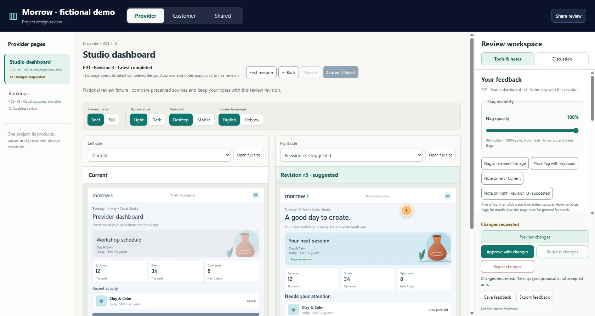
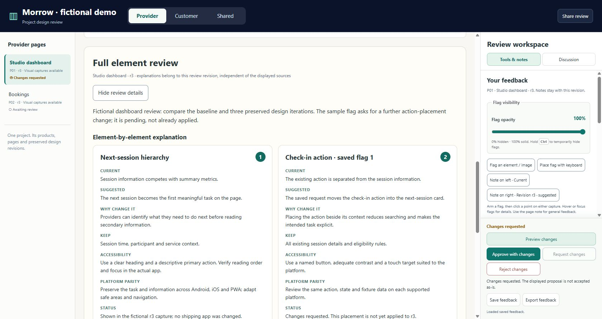

# Page-by-page Project Design Review

**Created by Arik Aizikovich.** A reusable agent skill and local review workspace for **Codex and Claude Code**. Compare a project's current UI, suggested designs, preserved revisions and external references while reviewing one page at a time.



## Why use it instead of a simple annotation?

A single HTML annotation is useful for a typo or a local element correction. A substantial redesign needs an inspectable alternative: see current and suggested screens side by side, flag a specific point, explain the tradeoff, compare iterations and keep the discussion with the exact evidence.

One workspace represents **a project**. Its products appear across the top; their pages are on the left. The two comparators occupy the center, with tools, notes and discussions in a right drawer. **Shared** is added automatically when a project has more than one product, including an empty state until shared items are inventoried. Provider and Customer are configurable example products, not built-in roles.

## Brief or Full

| Mode | What the reviewer sees |
| --- | --- |
| **Brief** | Comparisons, provenance, concise scope, feedback and decisions. The default. |
| **Full** | The same controls plus element explanations below the comparison: current, suggested, why, keep, accessibility, platform parity, evidence status and unresolved choices. |

The visible selector preserves notes and sources and saves the selected mode per project/browser. Prepared explanations open immediately; missing explanations offer **Generate review details**. Brief does not pre-generate hidden long prose. Explanation files match the review revision and saved feedback version; changed feedback invalidates old details.



## Features

- **Independent sources:** Current, any preserved revision, or a labeled external design on either side. Compare previous/new revisions or an inspected Stitch/Claude source with a proposal.
- **Relevant capture axes:** Light/Dark, Mobile/Desktop and Android/iOS/PWA in Mobile; locale and state where configured. Missing captures stay explicit.
- **Precise feedback:** Source-bound numbered flags for elements/images, hover/focus RichTips, keyboard placement, whole-page notes and contextual discussions.
- **Flag visibility:** Hold **Ctrl** to peek through hidden flags; release restores the saved setting. A visible **0–100% opacity slider** saves the preference across pages, revisions and reloads.
- **Instant full-size comparison:** Open either side; **Space/F** flips, arrows choose a side, **Esc** closes. Both images share scale/origin and preserve pan. Dimension mismatches are disclosed.
- **Preserved history:** First, Back, Next and Latest, immutable screenshots/hashes, revision-specific feedback and version-conflict protection.
- **Live iteration:** Explicit authorized change requests save and queue a bounded prototype pass while review continues. A connected agent claims work and publishes a new immutable revision; the shown design is still awaiting its own acceptance.
- **Accurate decisions:** Awaiting review, Changes requested, Approved as-is, Approved with changes and Rejected. Work authorization and visual approval are separate.
- **Preview and export:** Preserved interactive sources when prepared; honest requests when missing. JSON feedback export and exact local review links.
- **Language-aware generation:** The agent follows the user's language or explicit choice for all generated review content, controls, tooltips, replies, documents and narration, including RTL. The English starter requires localization; selecting a locale does not silently translate captured UI.

For Android/iOS/PWA parity, align the task, state, fixture data, locale, theme, viewport and revision. Compare equivalent information and outcomes while explaining intentional native differences. Screenshot similarity alone does not verify device integrations or runtime behavior.

## Install for Codex or Claude Code

Requires **Python 3.10+** for the helpers and **Node.js 22+** to serve the review. The board uses browser-native JavaScript and no package installation/build step.

```sh
git clone https://github.com/E-FL/project-design-review.git
cd project-design-review
python scripts/install_skill.py --client both
```

Use `--client codex` or `--client claude` to install only one. Personal installs copy the complete skill to:

- Codex: `~/.agents/skills/project-design-review/`
- Claude Code: `~/.claude/skills/project-design-review/`

For a repository-scoped installation:

```sh
python scripts/install_skill.py --client both --project /path/to/your/project
```

This uses `.agents/skills/` and `.claude/skills/` inside that project. Existing folders are preserved; the installer refuses overwrite. For an update, move or back up the old skill folder before reinstalling. Restart the client or open a new session to discover it.

Invoke in **Codex** with `$project-design-review`; invoke in **Claude Code** with `/project-design-review`. The same `SKILL.md` and supporting resources follow the [Codex skills conventions](https://learn.chatgpt.com/docs/build-skills) and [Claude Code skills conventions](https://code.claude.com/docs/en/skills). Client availability is native skill-format compatibility; no hosted AI service is bundled.

Example request:

> Use project-design-review in Full mode for this project's Provider and Customer products. Compare each current screen with a suggested revision, keep shared components in Shared, and explain the elements in Hebrew. Use synthetic fixtures.

## Give details in the skill run

After installation, describe the review directly. **You do not edit configuration files or run setup commands.** The agent creates the board, prepares the page inventory/captures and explanations, localizes the review and starts or reuses its local server.

Codex:

```text
$project-design-review Review Morrow with Provider and Customer products.
Provider: Android, iOS and PWA; Customer: PWA. Mobile and desktop.
Use Full mode, explain in Hebrew, and remember this project setup.
```

Claude Code:

```text
/project-design-review Review Morrow with Provider and Customer products,
Android/iOS/PWA, mobile and desktop, Full mode, in Hebrew. Remember the setup.
```

Later, invoke the skill with **“Continue the review”** or **“Switch to Brief”**. Saved details are reused; new instructions override only the specified choices. Project settings live in `.design-review/project.json` inside the active project, including the canonical board, products, capture axes, language, mode and local port. The agent manages this file. Feedback and visual revision history remain separate and preserved. Each project has its own setup.

The agent's [setup helper](skills/project-design-review/scripts/configure_review.py) resolves parameters and guards concurrent updates. See [invocation and project memory](skills/project-design-review/references/invocation-and-memory.md) for the agent workflow. Remembered settings do not imply a running server or connected worker; the agent verifies those on each run.

## Run the fictional showcase

```sh
python scripts/create_demo.py ../morrow-review --mode brief
cd ../morrow-review
node review-server.mjs
```

Open **http://127.0.0.1:5217/**. To use another port, set `REVIEW_PORT` in your shell before starting the server. On PowerShell: `$env:REVIEW_PORT='5244'`. Use the same `REVIEW_URL` when calling the worker helper on a different port.

Morrow is entirely fictional. Its Provider, Customer and Shared pages have three preserved design iterations. The demo contains a sample flag and matching Full explanations for the dashboard. Android/iOS/PWA captures and external-source examples are **simulations**, clearly labeled. Hebrew illustrates missing evidence; English captures are not presented as Hebrew. No real product screens, accounts or data are included.

Try switching products/pages, comparing r1/r3, selecting an external mock reference, hovering the dashboard flag, changing opacity, holding Ctrl, choosing Full, and opening a side full-size to flip with Space. Existing demo feedback is synthetic and safe to change in the generated folder.

## Review your project

Invoke the skill in your project and provide whichever details matter to you. The agent infers the rest from the project, asks only for essential missing choices, remembers the resolved setup and manages configuration/captures automatically. Inventory-only pages keep an honest missing-design state; Full explanations and inspected external sources are prepared by the agent under the same evidence rules.

The server binds to loopback and saves feedback in the review folder with a browser draft backup. **Share review** copies an exact local URL; it does not deploy the board or make it publicly reachable.

## Background work

The starter is **unconnected**. Local files cannot generate AI replies or designs by themselves. An authorized agent/driver reads `review-worker.mjs inbox`, claims the bounded request, verifies its prototype, then publishes via the protected completion action. The UI shows queued separately from claimed work. New revisions arrive without replacing an explicit historical view or unsaved notes.

See [worker connection and publication](skills/project-design-review/references/issue-worker.md), [shared worker ownership](skills/project-design-review/references/shared-conversations.md), [preview coverage](skills/project-design-review/references/preview-configuration.md) and [Brief/Full explanation schema](skills/project-design-review/references/compact-review.md). Review acceptance does not authorize product implementation or deployment.

## Validation

```sh
python scripts/validate_package.py
python -m unittest discover -s tests -v
node --test skills/project-design-review/assets/comparator/review-revisions.test.mjs skills/project-design-review/assets/comparator/review-server.test.mjs
```

Tests cover remembered invocation details, no-op resume, partial overrides, project isolation, setup conflicts, installation preservation, clean fictional generation, preserved asset hashes, protected revision publication and feedback/version handling. Browser checks cover the interactive controls; these checks do not claim physical-device parity or end-to-end Claude/Codex model execution.

## Author and license

**Arik Aizikovich** — [E-FL](https://github.com/E-FL). Licensed under [Apache License 2.0](LICENSE); see [NOTICE](NOTICE). Contributions are welcome under the [contribution guidelines](CONTRIBUTING.md).
