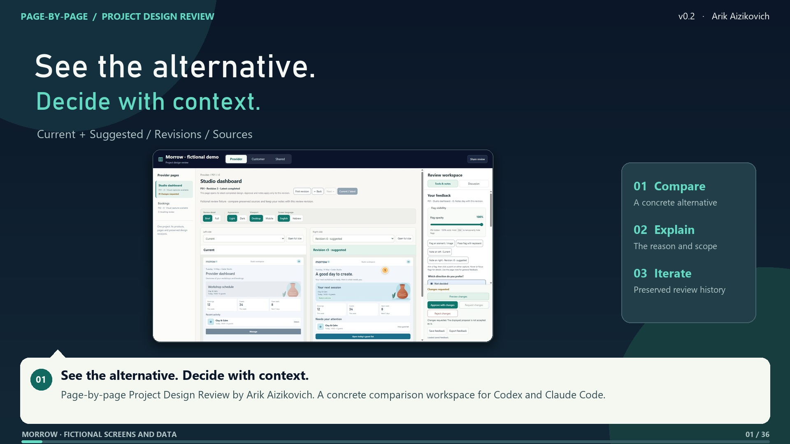

# Narrated video walkthrough

**Created by Arik Aizikovich.** Refreshed for skill v0.2: 7 minutes 18 seconds, 1920 × 1080, 25 fps. H.264 video, AAC English synthesized voice, embedded captions and chapter metadata. Every scene includes a readable on-screen narration card; the actual UI captures are paired with highlighted controls.

[Watch or download the MP4](https://github.com/E-FL/project-design-review/releases/download/v0.2.0/page-by-page-design-review-v0.2.mp4) · [Repository file](page-by-page-design-review-v0.2.mp4) · [Captions](walkthrough.vtt) · [Transcript](transcript.md) · [Chapter data](chapters.json)

## What is shown

The film uses the working review UI with disposable fictional Morrow data. Provider and Customer are products inside the Morrow project; Shared covers cross-product pages. It shows independent sources and revisions, platform/theme/locale controls, source-bound RichTips, keyboard placement, notes, opacity persistence, Brief/Full, full-size instant flipping, discussions, queued requests, prepared visual previews, approval/rejection and exact local sharing.

The skill-invocation and remembered-setup cards are explanatory graphics; creation/adoption and no-detail resume were verified using the setup helper. The Ctrl graphic uses the 0% visibility capture to illustrate the hidden state. The connected-worker flow is explicitly illustrative: the recorded board is unconnected, and its real request stays Queued. Platform and external Stitch/Claude captures are simulations, not native-device or external-generator evidence. Demonstration approvals were made only on the disposable recording fixture. No real product screens, accounts or data are included.

The prepared interactive preview was added to the recording fixture. A clean starter requires an agent-prepared source before this preview state is available; missing or outdated sources remain design-pass requests.

## Chapters

| Time | Chapter |
| --- | --- |
| 00:00 | See the alternative. Decide with context. |
| 00:11 | More than one annotation |
| 00:23 | Give the details in your request |
| 00:36 | Continue without repeating the setup |
| 00:47 | One project. Products inside it. |
| 01:00 | Review each product journey |
| 01:11 | Move page by page |
| 01:22 | Shared belongs to the project |
| 01:33 | Choose each comparator independently |
| 01:45 | Bring an external design into the comparison |
| 01:55 | The same workflow accepts other sources |
| 02:07 | Appearance is a separate choice |
| 02:18 | Check Android within its own context |
| 02:30 | Then inspect iOS |
| 02:42 | Compare the PWA on par |
| 02:55 | Language follows your request |
| 03:10 | Flag the exact element or image |
| 03:22 | Pointing is optional |
| 03:33 | Keep the page-level conversation clear |
| 03:44 | See through your flags |
| 03:56 | A temporary peek with Ctrl |
| 04:09 | Open either side at full size |
| 04:21 | Flip instantly, one on top of the other |
| 04:33 | Brief keeps the review compact |
| 04:45 | Full explains the elements below |
| 05:01 | Preserve every iteration |
| 05:14 | Discuss in context |
| 05:25 | A request can queue the next pass immediately |
| 05:37 | Keep reviewing while real work runs |
| 05:51 | Preview the prepared visual source |
| 06:04 | An interaction is still a prototype |
| 06:17 | Approval has precise meaning |
| 06:28 | Acceptance with changes is a distinct decision |
| 06:40 | Reject without losing evidence |
| 06:51 | Share this exact review |
| 07:04 | A review you can return to |

## Verification

The final MP4 was decoded from start to end with no reported errors. Media streams, dimensions, frame rate, duration and author metadata were checked with FFprobe. Narration segments were checked for nonzero audio and aligned to their chapters. Captions and chapter data cover the full duration. Selected rendered frames were inspected for readability, source context and accurate labels.

The video is committed directly in the repository and also uploaded as a v0.2.0 release asset for convenient playback/download. Checksums are in [walkthrough-SHA256SUMS.txt](walkthrough-SHA256SUMS.txt). The repository's Apache 2.0 license and Arik Aizikovich attribution apply.
